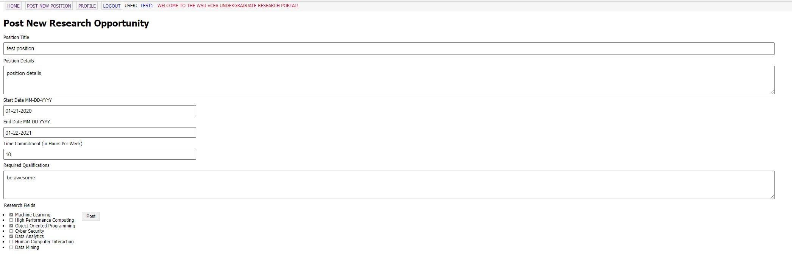
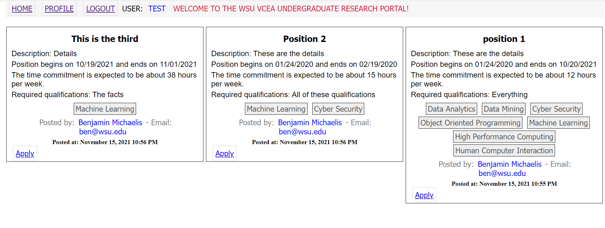
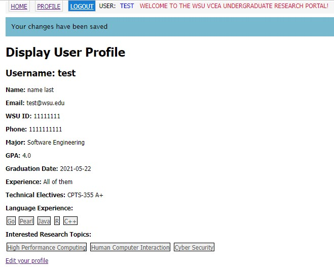
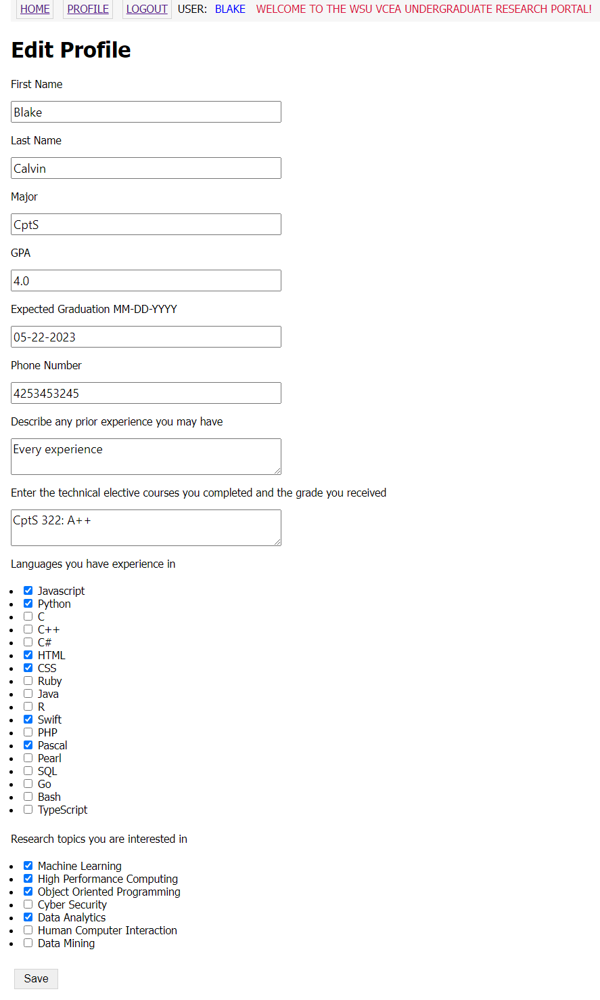
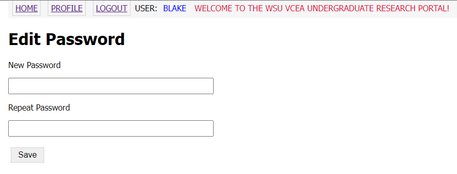
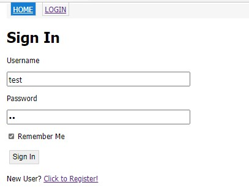

# Design Document - Iteration 2

## WSU EECS Undergraduate Research Website

--------
Prepared by:

* `Benjamin Michaelis`
* `Blake Thomas`
* `Eric Song`
* `Zach Griswold`

--------

**Course** : CptS 322 - Software Engineering Principles I

**Instructor**: Sakire Arslan Ay

--------

## Table of Contents

* [Design Document - Iteration 1](#design-document---iteration-1)
  * [WSU EECS Undergraduate Research Website](#wsu-eecs-undergraduate-research-website)
  * [Table of Contents](#table-of-contents)
  * [Document Revision History](#document-revision-history)
  * [1. Introduction](#1-introduction)
  * [2. Architectural and Component-level Design](#2-architectural-and-component-level-design)
    * [2.1 System Structure](#21-system-structure)
    * [2.2 Subsystem Design](#22-subsystem-design)
      * [2.2.1 Model](#221-model)
        * [List of tables](#list-of-tables)
      * [2.2.2 Controller](#222-controller)
        * [Controller Subsystems](#controller-subsystems)
      * [2.2.3 View and User Interface Design](#223-view-and-user-interface-design)
  * [3. Progress Report](#3-progress-report)
  * [4. Testing Plan](#4-testing-plan)
  * [5. References](#5-references)
    * [Appendix: Grading Rubric](#appendix-grading-rubric)

## Document Revision History

| Name | Date | Changes | Version |
| ------ | ------ | --------- | --------- |
| Revision 1 | 2021-10-05 | Initial draft | 1.0        |
| Revision 2 |2021-10-26 |Completed Section 1 and 2  | 2.0 |
| Revision 3 | 2021-10-27 | Completed Document | 3.0 |

## 1. Introduction

This design document is provided to describe the design of the
WSU EECS Undergraduate Research Website. Doing so will allow
development to proceed with a clear understanding of what is
going to be built and how it is expected to be build.

Then provide a brief description of your project and state your project goal.

The Project for which this document is for is the WSU EECS Undergraduate
Research Website. The goal is to create a website that will connect
students to faculty members who need undergraduate researchers.
Faculty will be able to post research opportunities, and students will
be able to look for and apply to posted positions.

Section II will include architectural details about the project.

Section III will include a Progress report for this iteration
(iteration 1).

## 2. Architectural and Component-level Design

### 2.1 System Structure

This section should describe the high-level architecture of your software:  i.e., the major subsystems and how they fit together.
If you adopted the application structure we used in the Smile App, your application would have the Model-View-Controller (MVC) pattern. If you adopted a different architectural pattern, mention the pattern you adopted in your software and briefly discuss the rationale for using the proposed architecture (i.e., why that pattern fits well for your system).

In this section:

* Provide a UML component diagram that illustrates the architecture of your software.
* Briefly explain the role of each subsystem in your architectural design and explain the dependencies between them.
* Discuss the rationale for the proposed decomposition in terms of cohesion and coupling.

The View subsystem includes any visual representation of information to the user.
The Model subsystem includes any logic that manages the data of the system.
The Controller subsystem accepts input and interprets it in to commands for the
Model or View subsystem.

The View Model Controller framework was chosen because of its tendency to have
high Cohesion, due to the logic being separated into View, Model, and Controller
components. Much of the logic in each component dealt with a specific category
of tasks for the app. This framework also promotes high coupling by making sure
the View, Model, and Controller components only interact in specific ways.

### 2.2 Subsystem Design

(Note: This is just a suggested template. If you adopted a pattern other than MVC, you should revise this template and the list the major subsystems in your architectural design.)

#### 2.2.1 Model

Briefly explain the role of the model.  

The role of the model is to manage the data, logic, and rules of the application. In other words,
it contains only pure application data. It does not handle any logic on how to present the data
to the user.

(***in iteration-1***) Include a list of the tables (models) in your database and explain the role of each table. Provide the attributes of the tables and briefly explain each attribute.

##### List of tables

* Post Table:

|  | Field name     | Description   | Field type  | Constraints | Comments |
|---|---------------|--------------|------------|------------|---------|
|1. |     id         | autogenerated id |  Integer | primary key | |
|2. |    title       | post title          | String | max 150 characters | |
|4. | description    | post text           | String | max 1500 characters | |
|5. |   startdate    | date posting begins | Date   | | |
|6. |  enddate       | date posting ends | Date | | |
|7. | timecommitment | how many hours a week | Integer | | |
|8. | qualifications | expected qualifications from applicants | String | max 1500 characters | |
|9. |  user_id       | id of who posted it | Integer | | |
|10.|  timestamp     | What time post was created | DateTime | Default is current utc time |

* Field Table:

|   | Field name     | Description   | Field type  | Constraints | Comments |
|:--|:---------------|:--------------|:------------|:------------|:---------|
|1. |     id         | autogenerated id |  Integer | primary key        |         |
|2. |   name       | name of the field         | String | max 20 characters    |         |

* User Table:

|   | Field name     | Description   | Field type  | Constraints | Comments |
|:--|:---------------|:--------------|:------------|:------------|:---------|
|1. |     id         | autogenerated id |  Integer | primary key             |              |
|2. |   username     | login name for user| String | max 64 characters             |              |
|4. |     email      | email address      | String | max 120 characters, unique     | |
|5. | password_hash  | password stored as a hash | String | max 128 characters | |
|6. |    posts       | date posting ends | Date |  | backref writer, lazy = dynamic  |
|7. |   faculty      | Whether this user is faculty | Boolean | default is False |           |
|8. |    admin       | Whether this user is an admin | Boolean | default is False |           |

(***in iteration -2***) Revise the database model. Provide a UML diagram of your database model showing the associations and relationships among tables. Your UML diagram should also show the methods of your models.

#### 2.2.2 Controller

The controller exists as a layer between the view and the model. It takes events from the
view, triggered by user actions, and calls the correct logic for each event. Usually this
will involve calling a method on the model.

##### Controller Subsystems

1. Authorization Forms \
   The authorization forms subsystem handles the creation of forms
   for logging in and registering users. It interacts with the model
   subsystem by looking up users, for the purpose of making sure the
   input email and username is unique. The types of forms we currently
   have are a LoginForm and a RegistrationForm

   a) LoginForm:
      This form is used to log in a user. It has the columns of a username,
      password, remember_me, and submit

   b) RegistrationForm: 
      This form is used to register a new user to the database. It has the
      columns of a username, firstname, lastname, email, phone, wsuid,
      password, password2, and a submit.

2. Authorization Routes \
   The authorization routes subsystem handles the logic for logging in
   and registering users. It interacts with the model by adding users
   to the data base when registering a user, and checking user login
   credentials when logging in a user. It also interacts with the controller
   component by getting the user input from LoginForm and registration form

   a) Register Route:
      This route is used for registering new users to the database. It first 
      checks if there is already a logged in user and returns that user to
      the main index page if the current_user exists. If there is no logged
      in user yet, the route understands the user would like to create an
      account and creates an instance of the registration form and renders 
      it on the page for them to fill out. Once filled out successfully, the
      route will then add the new user to the database and commit it. Lastly,
      it will flash them the message that their account was created successfully
      and redirect them to the login page.

   b) Login Route:
      This route is used for loging in users to the webapp. It first checks if 
      there is already a logged in user and returns that user to the main index 
      page if the current_user exists. If there is no logged in user yet, the 
      route will create in an instance of the login form and render it on the 
      screen for the user to fill out. Once filled out successfully, the route 
      will then set the current_user equal to the user credentials filled out
      in the login form to complete the log in process. Lastly, a message will
      be flashed on the screen to notify that they are logged in and will also
      remind them to complete their account by filling in the rest of the 
      non-mandatory information in the account page. Once it flashes the message, 
      the route redirects the user to the main index page and they are 
      successfully logged in.

   c) Logout Route:
      This route is used for logging out users from the webapp. If this route is
      being used, then it simply runs the logout_user() function built into flask
      which essentially unlinks the current_user from the credentials that was 
      previously used to log in. And once that is complete, there will be no
      logged in user on the webapp so the route will then redirect the user to
      the login screen.

3. Errors \
   Handles either 404 or 500 errors. Interacts with the models subsystem
   by rolling back the database when a 500 error is thrown.

4. Forms \
   The forms subsystem handles the creation of forms for posting forms,
   and eventually forms for other features. It has no dependencies. The types of forms 
   we have currently are PostForm, ApplyForm, EditForm, EditPasswordForm

   a) PostForm: 
      This form is used for creating a new post to the database. This form has
      the columns of a title, description, startdate, enddate, timecommitment, 
      ResearchFields, qualifications, submit, and apply
   
   b) ApplyForm: 
      This form is used for applying to posts. This form has the columns of a 
      description, refName, refEmail, and submit
   
   c) EditForm:
      This form is used for editting your profile information. This form has the 
      columns of a firstname, lastname, major, gpa, graduationDate, phone, 
      experience, electives, languages, fields, and submit

   d) EditPasswordForm:
      This form is used for editting your profiles password. This form has the 
      columns of a password, a password2, and a submit.

5. Routes \
   The routes subsystem handles the logic for adding a new post to
   the app. It interacts with the Model component by using the post
   model to create new posts.

   a) Index Route:
      This route is used for rendering the main home screen of the webapp. The
      main home screen is used for seeing all of the posts created in clean
      way. So, this route will query all of the posts in the database, and 
      present them to the user on the screen in an organized manner. 

   b) Post Route:
      This route is used for creating new posts to the webapp. This route can
      only be accessed by faculty users so it first checks to make sure 
      whoever is accessing this route is a faculty, and if they aren't, the 
      route will redirect them back to the main index page. However, if the
      user is faculty, then the route will create an instance of the post 
      form and render it to the screen for them. Once they fill out the post
      form correctly, the route will create a new post and add all of the 
      information from the form to that new post. Then it will add it to the
      database and commit those changes. Lastly, the route will flash them 
      a confirmation message that their post was created successfully and 
      redirect them to the main index page.

   c) Display Profile Route:
      This route is used to let the logged in user see their account 
      information. What this route does it simply just render the HTML for
      displaying their profile to the screen, while passing in a user variable
      to left the HTML know which user's information to render. This route 
      will not be accessible unless their is a logged in user. 

   d) Edit Profile Route:
      This route is used for processing the logic to edit someone's account
      information. A user must be logged in to access this route, and if one 
      is, then it will create an instance of the edit form and render it to
      the screen. Also, the route will populate the form with their prior 
      account information to make it easier on them if they only want to edit
      a couple things. Once the user fills out the form correctly, everything
      in the form will be updated to that users information and the route will
      then commit those changes to the database to finalize the saving process. 
      Lastly, the route will flash them a message to let the user know their
      changes have been saved and redirect them back to their account page.

   e) Edit Password Route:
      This route is used to change a user's password if they wish to. There 
      must be a logged in user for this route to be accessible, and will 
      redirect the user back to the index page if they aren't logged in. 
      If there is a logged in user, then the route understands they wish
      to change their password, so it creates an instance of the change 
      password form and renders it to the screen. Once the form has been
      filled out successfully and submitted, the current_user's password is
      changed and committed to the database. The route then flashes the user
      a message to notify them that their password is changed successfully, 
      and then redirects them back to their account screen.

   f) Apply Route:
      This route is used for a user to apply to one of the active posts. 
      There must be a logged in user for this route to be accessible, and will 
      redirect the user back to the index page if they aren't logged in. If 
      there is a logged in user, then the route will create an instance of the
      apply form and render it to the screen for the user to fill out. Once the
      form has been filled out successfully and submitted, a new application
      is created and populated with the information from the form. This new 
      application is then appended to the Applications column on the 
      specific post specified by the URL. After that, the changes are committed
      and the user is flashed a message notifying them that they have successfully
      applied to the position. Lastly, the user is redirected to the index page. 
   
   g) My Posts Route:
      This route is used for a user to be able to view all of the posts they 
      have created. There must be a logged in faculty user for this route to be 
      accessible, and will redirect the user back to the index page if they aren't 
      logged in or aren't faculty. If there is a logged in faculty user, the route 
      will query all of the posts that faculty user has created and render them
      to their screen. 

**Note:** Some of your subsystems will interact with the Web clients (browsers). Make sure to include a detailed description of the  Web API interface (i.e. the set of routes) your application will implement. For each route specify its “methods”, “URL path”, and “a description of the operation it implements”.  
You can use the following table template to list your route specifications.

(***in iteration-1***) Brainstorm with your team members and identify all routes you need to implement for the completed application and explain each route briefly. If you included most of the major routes but you missed only a few, it maybe still acceptable.

|   | Methods           | URL Path   | Description  |
|:--|:------------------|:-----------|:-------------|
|1. |  Get, Post        | /register/ | To registering new users |
|2. |  Get, Post        | /login/    | Logging in preexisting users |
|3. |  Get              | /logout/   | Log out the current user |
|4. |  Get, Post        | /index/    | Homepage of the site |
|5. |  Get, Post        | /post/     | For faculty to add a new post to the site  |

#### 2.2.3 View and User Interface Design

The role of the view component is to handle how to present the application to the user.
It can access the data in the model, but it does not deal not interpret or manipulate this
data. We intend on using the bootstrap library to handle most of the design aspects of the app.

In the registration form we have a user register for an account with valid information (such as a wsu email), and after filling this out without errors, they can login and get forwarded to their edit profile page. This is for Use-Case Create Account as a user without an account

From the faculty permissions, you have a button to make a new post which sends you to the make a new post page, where you fill out the details and submit the form. This is for Use-Case Create Research Position.

Then from the student page you can view all available posts. This is for Use-Case View open research positions.

To view profile information a user can click on view profile button and then the edit profile button to add additional information. Additionally, they can edit their password in a seperate form. This is for use-cases view and edit user profile/add profile information.

To log-in, the user when logged out is automatically redirected to the login screen. This is for use-case log in as a user.

## 3. Progress Report

In this iteration, we focused on adding the basic features for the app. Users can now create
accounts, as well as login and log out. Users can also edit the information on their profiles
For the faculty users, the ability to post research positions was also added. Faculty users can create a research position, and all users can view open research positions.

## 4. References

Cite your references here.

Title: Coupling and Cohesion Link: <https://www.geeksforgeeks.org/software-engineering-coupling-and-cohesion/>

--------
