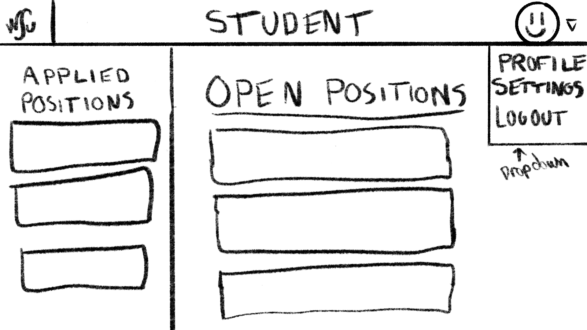

# WSU EECS Undergraduate Research Website - Software Requirements Specification

Prepared by:

* `Benjamin Michaelis`
* `Blake Thomas`
* `Eric Song`
* `Zach G`

--------

**Course** : CptS 322 - Software Engineering Principles I

**Instructor**: Sakire Arslan Ay

--------

## Table of Contents

- [WSU EECS Undergraduate Research Website - Software Requirements Specification](#wsu-eecs-undergraduate-research-website---software-requirements-specification)
  - [Table of Contents](#table-of-contents)
  - [Document Revision History](#document-revision-history)
  - [1. Introduction](#1-introduction)
    - [1.1 Document Purpose](#11-document-purpose)
    - [1.2 Product Scope](#12-product-scope)
    - [1.3 Document Overview](#13-document-overview)
  - [2. Requirements Specification](#2-requirements-specification)
    - [2.1 Customer, Users, and Stakeholders](#21-customer-users-and-stakeholders)
    - [2.2 Use Cases](#22-use-cases)
  - [!](#)
    - [2.3 Non-Functional Requirements](#23-non-functional-requirements)
  - [3. User Interface](#3-user-interface)
  - [4. References](#4-references)
  - [Appendix: Grading Rubric](#appendix-grading-rubric)

## Document Revision History

| Name      | Date   | Changes   | Version   |
| ------    | ------ | --------- | --------- |
| Revision 1 | 2021-10-05 | Initial draft | 1.0 |
| Revision 2 | 2021-10-13 | Completed Document | 2.0 |
|           |        |           |           |

--------k

## 1. Introduction

An overview as to what is expected to be built for the WSU EECS Undergraduate Research Website, and the requirements involved to accomplish that.

--------

### 1.1 Document Purpose

The goal of this document is to have one central place to collect all the requirements of what this website must do so that all the developers can understand what is required of the software including what to design, implement, and test; so the customers can know what will be delivered and so any managers can know in what timeline progress is to be made at.

### 1.2 Product Scope

This website will connect students and faculty together, allowing undergraduate students to find research opportunities and faculty to advertise research opportunities that they might have. This will allow students to also apply for research positions quickly and easily within this site, as well as allow faculty to follow up with students who are interested in their research opportunities.

### 1.3 Document Overview

From here on, different requirements will be covered, from expected use cases by users to the functionality that is expected both for the developer to implement and the customer to understand how the final product will function.

--------

## 2. Requirements Specification

--------

This section specifies the software product's requirements. Specify all of the software requirements to a level of detail sufficient to enable designers to design a software system to satisfy those requirements, and to enable testers to test that the software system satisfies those requirements.

### 2.1 Customer, Users, and Stakeholders

The customer for this site is Washington State University VCEA and the main users would be undergraduate students or faculty members at Washington State University.

--------

### 2.2 Use Cases

This section will include the specification for your project in the form of use cases. The section should start with a short description of the actors involved (e.g., regular user, administrator, etc.) and then follow with a list of the use cases.

For each use case you should have the following:

* Name,
* Actors,
* Triggers (what initiates the use case),
* Preconditions (in what system state is this use case applicable),
* Actions (what actions will the code take to implement the use case),
* Alternative paths
* Postconditions (what is the system state after the use case is done),
* Acceptance tests (list one or more acceptance tests with concrete values for the parameters, and concrete assertions that you will make to verify the postconditions).

Each use case should also have a field called "Iteration" where you specify in which iteration you plan to implement this feature.

You may use the following table template for your use cases. Copy-paste this table for each use case you will include in your document.

| Create application framework code |  |
| ------------------|---|
| Name              | Create framework code for application |
| Users             | N/A |
| Rationale         | Get a base working framework started to build off of |
| Triggers          | N/A |
| Preconditions     | N/A |
| Actions           | Refer to smile application to create framework to start our application with |
| Alternative paths | N/A |
| Postconditions    | N/A |
| Acceptance tests  | Flask application successfully builds and runs and database is built properly |
| Iteration         | Iteration-1 |

| Create Account as a user without an account      |  |
| ------------------|---|
| Name              | Create Account |
| Users             | Any non-logged in user |
| Rationale         | To be able to use the site you need to be able to create an account to use the site |
| Triggers          | You go to the registration page/click the button |
| Preconditions     | User has a valie @wsu.edu email that is not already tied to an account. |
| Actions           | User fills out form with required information, system validates email requirements, creates new account record, and user is sent to login page if successful |
| Alternative paths | Error is posted and user needs to use a different email that is actually valid (not used and is @wsu.edu) |
| Postconditions    | Account for user is created. |
| Acceptance tests  | User account is stored by system with correct information to what user supplied. |
| Iteration         | Iteration - 1 |

**Include a swim-lane diagram that illustrates the message flow and activities for following scenario:**
“A student applies to a research position; initially its status will appear as “Pending”. The faculty who created that position reviews the application and updates the application status to either “Approved for Interview”, or “Hired”, or “Not hired”. The updated status of the application is displayed on the student view.
The student may delete the pending applications (i.e., whose status is still “Pending”. )”

--------

### 2.3 Non-Functional Requirements

List the non-functional requirements in this section.

You may use the following template for non-functional requirements.

1. [Enter a Concise Requirement Name]:  [provide a concise description, in clear and easily understandable language to specify the requirement]

--------

## 3. User Interface

Student Sign Up page: 
Student main page: 
Student apply position page: 
Faculty main page: 
Faculty create position page: 

--------

## 4. References

Cite your references here.

For the papers you cite give the authors, the title of the article, the journal name, journal volume number, date of publication and inclusive page numbers. Giving only the URL for the journal is not appropriate.

For the websites, give the title, author (if applicable) and the website URL.

1. What is a Swimlane Diagram https://www.lucidchart.com/pages/tutorial/swimlane-diagram

--------
--------

## Appendix: Grading Rubric

(Please remove this part in your final submission)

These is the grading rubric that we will use to evaluate your document.

| Max Points  | **Content** |
| ----------- | ------- |
| 10          | Do the requirements clearly state the customers’ needs? |
| 5           | Do the requirements avoid specifying a design (note: customer-specified design elements are allowed; non-functional requirements may specify some major design requirements)? |
| | |  
|    | **Completeness** |
| 25 | Are use cases written in sufficient detail to allow for design and planning? |
| 4 | Do use cases have acceptance tests? |
| 20 | Is your use case model complete? Are all major use cases included in the document? |
| 8 | Has the team provided an appropriate swim-lane diagram for the scenario where faculty reviews a student’s application? |
| 10 |  Are the User Interface Requirements given with some detail? Are there some sketches, mockups?  |
|
|   | **Clarity** |
| 4 | Is the document carefully written, without typos and grammatical errors? |
| 2 | Is each part of the document in agreement with all other parts? |
| 2 | Are all items clear and not ambiguous? (Minor document readability issues should be handled off-line, not in the review, e.g. spelling, grammar, and organization). |
|   |   |
|    | **GitHub Issues** |
| 10 | Has the team setup their GitHub Issues page? Have they  generated the list of user stories, use-cases, created milestones, assigned use-cases (issues) to milestones?   Example GitHub repo (check the issues): <https://github.com/WSU-CptS322-Fall2021/TermProjectSampleRepo/issues> |
