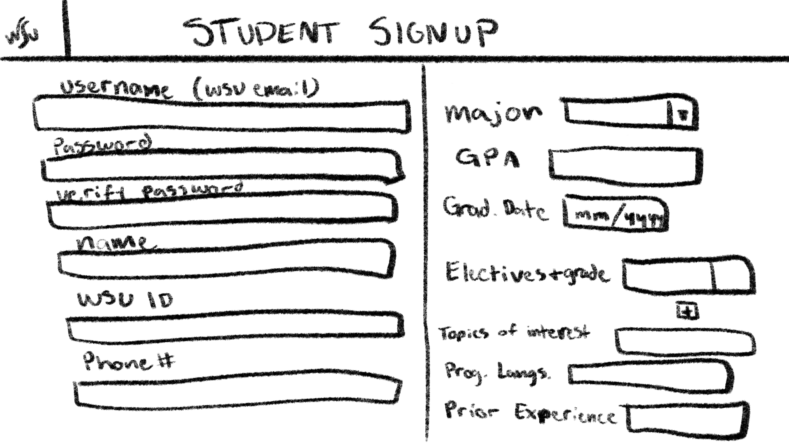
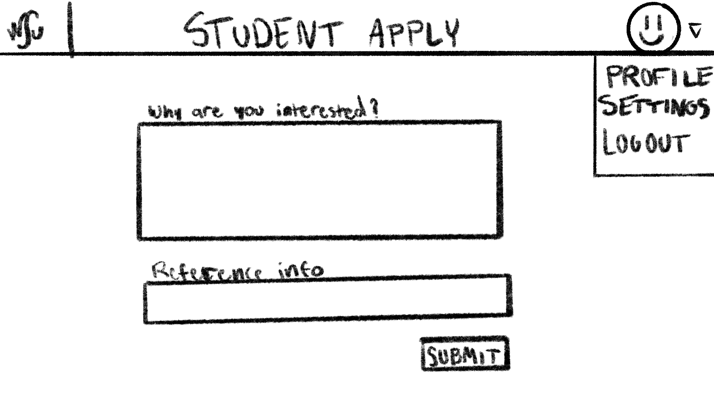
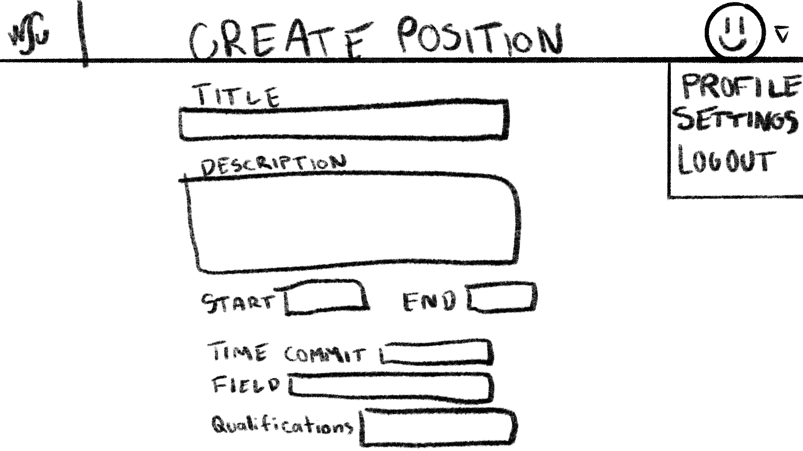

# WSU EECS Undergraduate Research Website - Software Requirements Specification

Prepared by:

* `Benjamin Michaelis`
* `Blake Thomas`
* `Eric Song`
* `Zach G`

--------

**Course** : CptS 322 - Software Engineering Principles I

**Instructor**: Sakire Arslan Ay

--------

## Table of Contents

* [WSU EECS Undergraduate Research Website - Software Requirements Specification](#wsu-eecs-undergraduate-research-website---software-requirements-specification)
  * [Table of Contents](#table-of-contents)
  * [Document Revision History](#document-revision-history)
  * [1. Introduction](#1-introduction)
    * [1.1 Document Purpose](#11-document-purpose)
    * [1.2 Product Scope](#12-product-scope)
    * [1.3 Document Overview](#13-document-overview)
  * [2. Requirements Specification](#2-requirements-specification)
    * [2.1 Customer, Users, and Stakeholders](#21-customer-users-and-stakeholders)
    * [2.2 Use Cases](#22-use-cases)
    * [2.3 Non-Functional Requirements](#23-non-functional-requirements)
  * [3. User Interface](#3-user-interface)
  * [4. References](#4-references)
  * [Appendix: Grading Rubric](#appendix-grading-rubric)

## Document Revision History

| Name      | Date   | Changes   | Version   |
| ------    | ------ | --------- | --------- |
| Revision 1 | 2021-10-05 | Initial draft | 1.0 |
| Revision 2 | 2021-10-13 | Completed Document | 2.0 |
|           |        |           |           |

--------

## 1. Introduction

An overview as to what is expected to be built for the WSU EECS Undergraduate Research Website, and the requirements involved to accomplish that.

--------

### 1.1 Document Purpose

The goal of this document is to have one central place to collect all the requirements of what this website must do so that all the developers can understand what is required of the software including what to design, implement, and test; so the customers can know what will be delivered and so any managers can know in what timeline progress is to be made at.

### 1.2 Product Scope

This website will connect students and faculty together, allowing undergraduate students to find research opportunities and faculty to advertise research opportunities that they might have. This will allow students to also apply for research positions quickly and easily within this site, as well as allow faculty to follow up with students who are interested in their research opportunities.

### 1.3 Document Overview

From here on, different requirements will be covered, from expected use cases by users to the functionality that is expected both for the developer to implement and the customer to understand how the final product will function.

--------

## 2. Requirements Specification

--------

This section specifies the software product's requirements. Specify all of the software requirements to a level of detail sufficient to enable designers to design a software system to satisfy those requirements, and to enable testers to test that the software system satisfies those requirements.

### 2.1 Customer, Users, and Stakeholders

The customer for this site is Washington State University VCEA and the main users would be undergraduate students or faculty members at Washington State University.

--------

### 2.2 Use Cases

This section will include the specification for your project in the form of use cases. The section should start with a short description of the actors involved (e.g., regular user, administrator, etc.) and then follow with a list of the use cases.

For each use case you should have the following:

* Name,
* Actors,
* Triggers (what initiates the use case),
* Preconditions (in what system state is this use case applicable),
* Actions (what actions will the code take to implement the use case),
* Alternative paths
* Postconditions (what is the system state after the use case is done),
* Acceptance tests (list one or more acceptance tests with concrete values for the parameters, and concrete assertions that you will make to verify the postconditions).

Each use case should also have a field called "Iteration" where you specify in which iteration you plan to implement this feature.

You may use the following table template for your use cases. Copy-paste this table for each use case you will include in your document.

| Create Account as a user without an account      |  |
| ------------------|---|
| Name              | Create Account |
| Users             | Any non-logged in user |
| Rationale         | To be able to use the site you need to be able to create an account to use the site |
| Triggers          | You go to the registration page/click the button |
| Preconditions     | User has a valie @wsu.edu email that is not already tied to an account. |
| Actions           | User fills out form with required information, system validates email requirements, creates new account record, and user is sent to login page if successful |
| Alternative paths | Error is posted and user needs to use a different email that is actually valid (not used and is @wsu.edu) |
| Postconditions    | Account for user is created. |
| Acceptance tests  | User account is stored by system with correct information to what user supplied. |
| Iteration         | Iteration - 1 |

| Log in as a user  |  |
| ------------------|---|
| Name              | Log into Account |
| Users             | Any user with proper credentials |
| Rationale         | Users should be able to log back in and have their information and applications/positions saved |
| Triggers          | Go to the homepage and click on returning user |
| Preconditions     | User has a valid @wsu.edu email with a valid password |
| Actions           | User fills out form with email and password, and user is sent to login page if successful |
| Alternative paths | Error is posted and user needs to enter valid credentials |
| Postconditions    | User is logged into their account and taken to their homepage |
| Acceptance tests  | User account is now logged in. |
| Iteration         | Iteration - 1 |

| Create Research Position  |  |
| ------------------|---|
| Name              | Create Research position |
| Users             | Any faculty member who is currently logged in |
| Rationale         | Faculty members should be able to create Research positions for students to apply to |
| Triggers          | Go to the homepage and click on create research position |
| Preconditions     | User is a logged in faculty member |
| Actions           | User fills out form with details about the research position, and it is posted when successful |
| Alternative paths | Error is posted and user needs to fill out required fields |
| Postconditions    | Research position is posted to the site |
| Acceptance tests  | Research position appears in database of currently open positions |
| Iteration         | Iteration - 1 |

| Apply to Research Position  |  |
| ------------------|---|
| Name              | Apply to Research Position |
| Users             | Any student who is currently logged in |
| Rationale         | Students should be able to apply to the research positions that faculty have posted |
| Triggers          | Click the apply button on a research posting |
| Preconditions     | User is a logged in as a student |
| Actions           | User fills out form with a statement about the research topic and the name + email of a faculty member as a reference |
| Alternative paths | Error is posted and user needs to fill out required fields |
| Postconditions    | Research position is displayed as applied to student, and as pending to faculty who posted it |
| Acceptance tests  | Student application is created and stored |
| Iteration         | Iteration - 1 |

| Cancel Research Position Application |  |
| ------------------|---|
| Name              | Cancel Research Position Application |
| Users             | Any student who has already applied to a research position and is logged in |
| Rationale         | Students should be able to cancel any applications if they change their mind |
| Triggers          | Click the x button on a research posting |
| Preconditions     | User is a logged in as a student and has already applied to the specific position, which has not been reviewed yet by the faculty member who posted it|
| Actions           | User clicks on cancel application then hits confirm in the subsequent dialog box |
| Alternative paths | Error is posted and user needs to try and cancel again |
| Postconditions    | Research position is no longer displayed as applied to as student, and the application is no longer visiable to the faculty member |
| Acceptance tests  | Research position application for this student no longer exists |
| Iteration         | Iteration - 1 |

| View Open Research Positions |  |
| ------------------|---|
| Name              | View Open Research Positions  |
| Users             | Any student who is currently logged in |
| Rationale         | Students should be able view open applications and choose a research topic that interests them |
| Triggers          | User logs in as student, then is taken to home page where research position are displayed |
| Preconditions     | User is a logged in as a student |
| Actions           | User logs in as student, then is taken to home page where research positions are displayed |
| Alternative paths | Error is posted and user needs to try and log in again |
| Postconditions    | Research position are displayed on student homepage |
| Acceptance tests  | Research position UI elements are visible on student homepage |
| Iteration         | Iteration - 1 |

| Expand Research Position |  |
| ------------------|---|
| Name              | Expand Research Position  |
| Users             | Any student or faculty member who is currently logged in |
| Rationale         | Students should be able to click on a research position and get more information about it, like a brief description, start/end date, required time commitment, research fields, required qualifications, and faculty name + contact information |
| Triggers          | User clicks on a research position on the home page |
| Preconditions     | User is a logged in as a student |
| Actions           | User clicks on a position, then is taken to a page where all relevant information about the posting is displayed |
| Alternative paths | Error is posted and user needs to try again |
| Postconditions    | Research position details are displayed |
| Acceptance tests  | Research position detail UI elements are visible on student homepage |
| Iteration         | Iteration - 1 |

**Include a swim-lane diagram that illustrates the message flow and activities for following scenario:**
“A student applies to a research position; initially its status will appear as “Pending”. The faculty who created that position reviews the application and updates the application status to either “Approved for Interview”, or “Hired”, or “Not hired”. The updated status of the application is displayed on the student view.
The student may delete the pending applications (i.e., whose status is still “Pending”. )”

--------

### 2.3 Non-Functional Requirements

List the non-functional requirements in this section.

You may use the following template for non-functional requirements.

1. [Enter a Concise Requirement Name]:  [provide a concise description, in clear and easily understandable language to specify the requirement]

--------

## 3. User Interface

Student Sign Up page: 
Student main page: 
Student apply position page: 
Faculty main page: 
Faculty create position page: 

--------

## 4. References

* What is a Swimlane Diagram: <https://www.lucidchart.com/pages/tutorial/swimlane-diagram>
